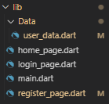

# login_register_flutter

LAPORAN PRAKTIKUM LOGIN_REGISTER_FLUTTER

#Praktikum Percobaan
Membuat folder Login_Register_Flutter lalu menambahkan bebrapa file dalam folder tersebut

Kode main dart

Kode user_data

Kode Register_page

Kode login_page

Kode home_page

Hasil Percobaan

